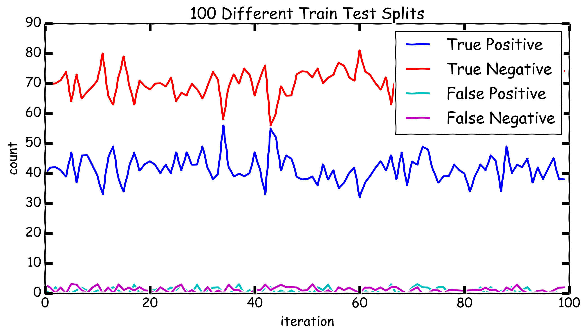

# Breast_Cancer_Classification

## Inspiration
Health is a passion of mine and if I can use data science to help make people
live happy and healthier lives I will. I was also looking for a data set that
both peaked my interest and gave me an opportunity to work with classification
models because I've found myself doing regressions quite a bit lately. This
satisfied both those criteria.

## The Data Set
It consists of two classes, benign and malignant. There are 357 benign cases
and 212 malignant cases totaling 569. The features for each case were computed
 from a digitized image of a digitized image of a fine needle aspirate (FNA) of
 a breast mass and describe characteristics of the cell nuclei present in the
 image. So it's a small data set, it's a little imbalanced having more benign
 cases, thank god for that, but it's not a crazy imbalance.

 The features consist of the mean, standard error and largest of all of the
 features listed below; with this we end up with 30 features.

 ```python
features = radius,texture,perimeter,area,smoothness,compactness,
           concavity,concave_points,symmetry,fractal_dimension
```

## What features should I use?
The million dollar question. So I want to run a model using only one feature in
the X and see which one has the most signal, then run it with two and see which
combination of two features has the best signal, and so on. The best way to do
this is using Feature ranking with recursive feature elimination, conveniently
`sklearn` has a function that does exactly this and then assigns a rank to each
feature representing there importance in the model
`sklearn.feature_selection.RFE()`. So I cooked up a few functions
`pick_best_features()` and `how_many_features_do_we_want()` that use Logistic
Regression to run models for the different number of features, rank them and
display them so that I can see how many features you need to use before the model
performance stops improving. For this data set, after normalizing the features
to be centered around zero it ended up that using the best 16 features from the
ranking was all the more features we need to use to get the best performance.

## So many Models to pick from
Time to Grid search. My `Grid_Search_All` class came in very handy here because
there are a ton of really good options for classification models that I need to
compare to each other. Once run it outputs a pandas dataframe that ranks and
sorts them by how well they perform. Here are the models and hyperparameters I
went with.

```python
models = {'LogisticRegression':LogisticRegression(),
          'RandomForestClassifier':RandomForestClassifier(),
          'ExtraTreesClassifier':ExtraTreesClassifier(),
          'AdaBoostClassifier':AdaBoostClassifier(),
          'GradientBoostingClassifier':GradientBoostingClassifier(),
          'LinearSVC':LinearSVC(),
          'SVC':SVC(),
          'BaggingClassifier':BaggingClassifier(),
          'SGDClassifier':SGDClassifier()
         }

parameters = {'LogisticRegression':{'C':[0.01, 0.1, 1.0, 10.0, 100.0,1000.0]},
              'RandomForestClassifier':{'n_estimators':[16,32,64,128,256]},
              'ExtraTreesClassifier':{'n_estimators':[16,32,64,128,256]},
              'AdaBoostClassifier':{'n_estimators':[16,32,64,128, 150],
                                   'learning_rate':[0.5,0.8,1.0,1.2,1.5]},
              'GradientBoostingClassifier':{'n_estimators':[64,128,150,200],
                                           'learning_rate':[0.01,0.08,0.1,0.2,0.4]},
              'LinearSVC':{'C':[0.01, 0.05, 0.1, 0.5, 1.0, 10.0, 100.0,1000.0,10000.0]},
              'SVC':{'C':[0.5, 1.0, 10.0, 100.0,1000.0,10000.0]},
              'BaggingClassifier':{'n_estimators':[5, 10, 15, 20, 25, 30, 100, 150, 200]},
              'SGDClassifier':{'alpha':[0.000001, 0.00001, 0.0001, 0.001, 0.01]}
             }
```

This is a good time to briefly talk about the issues that arise when you do a
train test split or a cross_validation on a data set that is less than 600.
Basically there is a noticeable difference in model performance between two
different runs depending on where the data ended up. With a dataset this small
even though it is random splits the train and test sets are not always
representative of each other. This showed it's head when doing grid search,
the performance of different models with different hyperparameters was not
consistent, and there was no clear best model with only one run. To solve this
I ran the grid search a number of times and by doing that I was able to see
which model tended to perform the best.

## The winner!
The winning model ended up being `LinearSVC(C=0.05)` and it only barely squeaked
out the win from `LogisticRegression(C=0.1)`, so take note, never overlook
logistic regression. Now that I new what general model I was going to use I ran
one last grid search on it to dial it in just a little bit more.

```python
parameters2 = {'LinearSVC':{'C':[0.01, 0.05, 0.1],
                            'tol':[0.00001, 0.0001, 0.001, 0.01],
                            'max_iter':[500, 750, 1000, 1250, 1500],
                            'loss':['hinge','squared_hinge']}
              }
```

And I ended up going with `LinearSVC(C=0.01)` in the end.

## Precision, Recall, True Positive, False what?
Because I am classifying breast cancer the absolute worst thing I could do is
send a women home thinking she is free and clear when she in fact has full blown
breast cancer, this is called a False Negative. If you can build a model that
performs so well that it has no False classifications awesome. But since this is
the real world you end up needing to skew the classification predictions one way
or the other depending on what you want to do; in my case that is minimize
False Negatives. My model was performing well without skewing anything with an
`Average Precision: 0.99`, `Average Recall: 0.94`, `Average F-1 Score: 0.97` and
`Average FN Rate: 2.07%` doctors false negative rate in the real world is 2-4%,
so I'm already doing pretty well but the lowest number here is Recall and from
the definitions below you can see that that is the one we want to maximize the
most, lives literally depend on it. I'm going to move the threshold.

```python
Precision: tp / (tp + fp)

Recall: tp / (tp + fn)

F1_score: 2 * (Precision * Recall) / (Precision + Recall)
```

## Threshold with LinearSVC?
Nope...not even a little bit. `linearSVC()` in sklearn implementation only has a
`predict()` method that predicts the class, not the probabilities like you can do
with LogisticRegression. This is solvable because sklearn is open source and on
Github. If you look at the source code you will find this
`self.decision_function(X)`, when you print it out, read the code, and play with
it a bit you can see that it assigns everything above a zero to class 1 and
everything else to class 0. So that is my threshold now and all I have to do is
create my own predict method where I can adjust the threshold up or down from
zero. After a little graphing that shows us this.


You can see that the best threshold is where the lines cross, this maximizes
Recall without making Precision or the F1_score bad. That value for the
threshold is -0.13.

## Performance
With all these tweaks my model now performs even better, with an
`Average Precision: 0.98`, `Average Recall: 0.97`, `Average F-1 Score: 0.97` and
`Average FN Rate: 1.03%`, pretty good.

## Closing Arguments
If you want to follow along with how I went through this process take a look at
exploration.ipynb, it's a little cleaner than if I didn't delete anything but
it's all in order and can be run from top to bottom without blowing up. If you
just want to see my final model take a look at run_model.py, it outputs this:

```python
########################################
########################################
Model is: LinearSVC(C=0.01)
   Number of test cases: 114
Average False Positives: 1.15
Average False Negatives: 1.29
        Average FN Rate: 1.13%
      Average Precision: 0.97
         Average Recall: 0.97
      Average F-1 Score: 0.97
```



You can see from the graph just how variable this dataset can be depending on
how the train and test sets are split, random isn't random enough with this
size of dataset.

#### Packages used


* sqlite3
* pandas
* numpy
* sklean
* Matplotlib.pyplot
